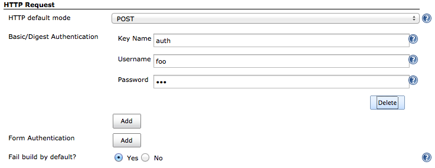
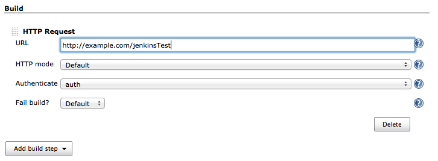
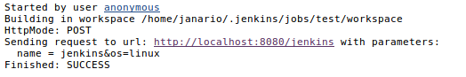

[[http-request-plugin]]
= Http Request Plugin
:toc: macro
:toc-title: HTTP Request Plugin ToC
ifdef::env-github[]
:tip-caption: :bulb:
:note-caption: :information_source:
:important-caption: :heavy_exclamation_mark:
:caution-caption: :fire:
:warning-caption: :warning:
endif::[]

link:https://ci.jenkins.io/job/Plugins/job/http-request-plugin/job/master/[image:https://ci.jenkins.io/job/Plugins/job/http-request-plugin/job/master/badge/icon[Build]]
link:https://github.com/jenkinsci/http-request-plugin/graphs/contributors[image:https://img.shields.io/github/contributors/jenkinsci/http-request-plugin.svg?color=blue[Contributors]]
link:https://plugins.jenkins.io/http_request/[image:https://img.shields.io/jenkins/plugin/i/http_request.svg?color=blue&label=installations[Jenkins Plugin Installs]]
link:https://plugins.jenkins.io/http_request/[image:https://img.shields.io/jenkins/plugin/v/http_request.svg[Plugin]]
link:https://github.com/jenkinsci/http-request-plugin/releases/latest[image:https://img.shields.io/github/release/jenkinsci/http-request-plugin.svg?label=changelog[GitHub release]]

toc::[]

[abstract]
.Overview
This plugin sends a HTTP/HTTPS request to a user specified URL. The request is made as a job 
execution in Jenkins and depending of the HTTP response the job could be marked as failed 
(configurable). For example, responses such as 404 and 500 could make the job fail. When a
job fails it will log the response to help identify the problem. The request may be  as an HTTP GET 
or POST mode, by choosing the HTTP mode. If it was not informed, it will use the default from global
settings whose default is POST.

== Features

The following features are available in both Pipeline and traditional project types:

* Programmable HTTP method: GET, POST, PUT, PATCH, DELETE, or HEAD
* Programmable range of expected response codes (a response code outside the range fails the build)
* Supports Basic Authentication (see global configuration)
* Supports Form Authentication (see global configuration)
* You can specify a string that must be present in the response (if the string is not present, the 
  build fails)
* You can set a connection timeout limit (build fails if timeout is exceeded)
* You can set an "Accept" header directly
* You can set a "Content-Type" header directly
* You can set any custom header

=== Basic plugin features

[NOTE]
.Feature Availability
====
The following features are only present in the non-pipeline version of the plugin. For the Pipeline 
version, these features are available programmatically.
====

* You can send the build parameters as URL query strings
* You can store the response to a file, built-in to the plugin

=== Pipeline features

In a Pipeline job, you have total control over how the url is formed. Suppose you have a build 
parameter called "`param1`", you can pass it to the HTTP request programmatically like so:

[source,groovy]
----
httpRequest "http://httpbin.org/response-headers?param1=${param1}"
----

If you wish to save the response to a file, you need to grab a workspace. You can do this with a 
`node` Pipeline step. For example:

[source,groovy]
----
def response = httpRequest "http://httpbin.org/response-headers?param1=${param1}"
node() {
    writeFile file: 'response.txt', text: response.content
}
----

You can access the response status code and content programmatically:

[source,groovy]
----
def response = httpRequest "http://httpbin.org/response-headers?param1=${param1}"
println('Status: '+response.status)
println('Response: '+response.content)
----

You may also send content in the body of the request, such as for a PATCH request:

[source,groovy]
----
// create payload
def patchOrg = """
    {"description": "$description"}
"""
def response = httpRequest acceptType: 'APPLICATION_JSON', contentType: 'APPLICATION_JSON', httpMode: 'PATCH', requestBody: patchOrg, url: "https://api.github.com/orgs/${orgName}"
----

You can also set custom headers:

[source,groovy]
----
def response = httpRequest customHeaders: [[name: 'foo', value: 'bar']]
----

You can send ``multipart/form-data`` forms:

[source,groovy]
----
def response = httpRequest httpMode: 'POST', formData: [[contentType: 'application/json', name: 'model', body: '{"foo": "bar"}'], [contentType: 'text/plain', name: 'file', fileName: 'readme.txt', uploadFile: 'data/lipsum.txt']]
----

For details on the Pipeline features, use the Pipeline snippet generator in the Pipeline job 
configuration.

[WARNING]
.Known Limitations
====
If Jenkins is restarted before the HTTP response comes back, the build will fail.
====

== Building

The plugin can be built and tested locally using a Maven Docker container:

[source, bash]
----
docker run -it --rm -v "$(pwd)":/usr/src/mymaven -w /usr/src/mymaven maven:3.3-jdk-8 mvn test
----

== Configure Global Settings

== Configure Build Step in your Jenkins job

== HTTP Request Parameters

Parameters are escaped, which means if you try to pass another value inside a value, it will not 
happen.

In the example below, the key "`name`" will be passed with a value of "`jenkins&os=linux`". Note 
that "`os`" is not a parameter - it is part of the value). At the HTTP server-side no parameter 
named "`os`" will exist.

[CAUTION]
.Regarding Logging & Sensitive Information
====
Every execution will log all parameters. Be careful to not pass private information such as 
passwords or personal information.
====

== Issues

Report issues and enhancements in the https://issues.jenkins.io/[Jenkins issue tracker].
Use the `http-request-plugin` component in the `JENKINS` project.

== Contributing

Refer to our https://github.com/jenkinsci/.github/blob/master/CONTRIBUTING.md[contribution guidelines].

== License

Licensed under link:LICENSE[the MIT License].
